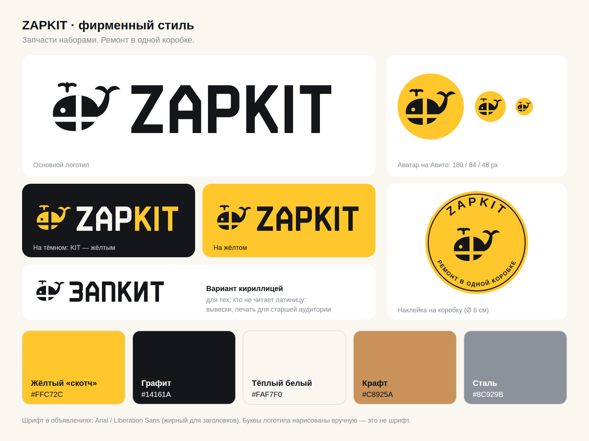

# Бренд ZAPKIT

**ZAPKIT — ремонт в одной коробке.**

ZAP — от «запчасти», KIT по-английски значит «набор». По-русски «кит» — это кит, отсюда талисман: **кит, перевязанный лентой, как посылка**.



Буквы логотипа нарисованы геометрией вручную, шрифты не используются. Поэтому логотип оригинальный и одинаково выглядит в любом редакторе.

## Файлы

| Файл | Назначение |
|---|---|
| `png/zapkit-avatar.png` | **Аватар магазина на Авито** (жёлтый: лучше всего виден в ленте) |
| `png/zapkit-avatar-dark.png` | Аватар, тёмный вариант (соцсети) |
| `png/zapkit-logo-dark.png` | Логотип для светлого фона |
| `png/zapkit-logo-light.png` | Логотип для тёмного фона: ZAP белым, KIT жёлтым |
| `png/zapkit-logo-on-yellow.png` | Логотип для жёлтого фона |
| `png/zapkit-lockup-dark.png` / `-light.png` | Логотип со слоганом |
| `png/zapkit-logo-cyrillic.png` | Вариант «ЗАПКИТ» кириллицей |
| `png/zapkit-mark.png` | Кит отдельно |
| `png/zapkit-sticker.png` | Круглая наклейка на коробку |
| `png/avito-cover-desktop-1202x436.png` | Обложка магазина на Авито для компьютера (нужна подписка Авито Pro) |
| `png/avito-cover-mobile-1242x936.png` | Обложка магазина на Авито для телефона (нужна подписка Авито Pro) |
| `png/zapkit-brand-board.png` | Всё на одном листе |
| `svg/*.svg` | Те же файлы в векторе: для печати коробок, наклеек, вывесок |

Фото объявлений, карты ремонта, наклейки для печати и макет магазина лежат в `avito/png/`.

Лента на ките нарисована цветом фона. Поэтому каждый вариант логотипа ставьте на свой фон: *dark* на светлый, *light* на графит, *on-yellow* на жёлтый.

## Цвета

| Цвет | HEX | Где |
|---|---|---|
| Жёлтый «скотч» | `#FFC72C` | Главный акцент: аватар, лента, плашки |
| Графит | `#14161A` | Кит и буквы на светлом, тёмные фоны |
| Тёплый белый | `#FAF7F0` | Фон карточек |
| Крафт | `#C8925A` | Коробки |
| Сталь | `#8C929B` | Второстепенный текст |

## Правила

- Вокруг логотипа оставляйте свободное поле не меньше половины высоты кита.
- Кит всегда смотрит влево, хвостом вверх. Не отражайте, не поворачивайте, не растягивайте его.
- Не добавляйте тени, обводки и градиенты.
- Жёлтый текст на белом фоне не используйте: он не читается.

## Голос бренда

Дружелюбно, коротко, по делу:
- «Всё для замены колодок — в одной коробке».
- «Ваш кит уже плывёт 🐋» (отправлено), «Кит приплыл!» (доставлено).
- «Не хватило детали по нашей вине — довезём бесплатно».

## Как изменить и перегенерировать

```bash
python3 brand/tools/build_brand.py                                        # логотипы → brand/svg
python3 avito/tools/build_avito.py                                        # карточки, печать, макет → avito/svg
NODE_PATH=$(npm root -g) node brand/tools/render.js brand/svg brand/png   # PNG (нужен playwright)
NODE_PATH=$(npm root -g) node brand/tools/render.js avito/svg avito/png
python3 avito/tools/build_sheet.py --force                                # таблица закупки (перезапишет цены!)
```

После `build_sheet.py` пересчитайте формулы (LibreOffice Calc), иначе значения в файле появятся только при открытии в Excel. Без `--force` скрипт не тронет существующую таблицу с вашими ценами.

- Кит, буквы, иконки деталей и цвета заданы в `brand/tools/zapkit.py`.
- Составы китов для карточек лежат в `avito/kits.json`: добавьте кит, запустите сборку, и появятся новые фото.
