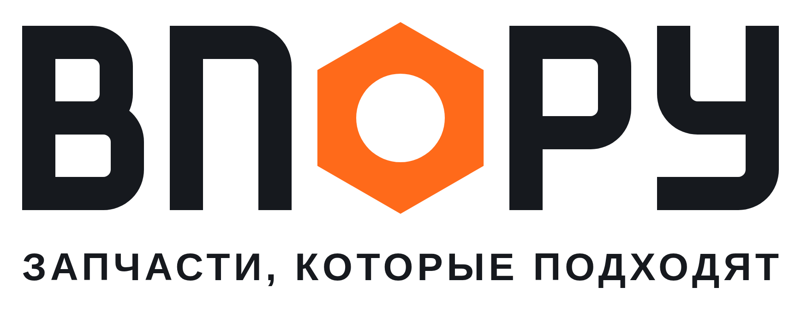

# Бренд ВПОРУ

**ВПОРУ: запчасти, которые подходят.**

«Впору» значит «в самый раз, точно по размеру». Второе прочтение, «в пору», значит «вовремя».



## Идея знака

Буква **«О» сделана в виде шестигранной гайки**: отверстие гайки и есть «О». В отдельном знаке и на аватаре внутри гайки стоит галочка, то есть «подходит». Буквы нарисованы геометрией вручную, шрифты не используются, поэтому логотип оригинальный и одинаково выглядит в любом редакторе.

## Файлы

| Файл | Назначение |
|---|---|
| `png/vporu-avatar-1024.png` | **Аватар магазина на Авито**, основной (оранжевый) |
| `png/vporu-avatar-dark-1024.png` | Аватар, тёмный вариант (Telegram, VK) |
| `png/avito-cover-1920x640.png` | Обложка магазина на Авито. Размер сверьте при загрузке, главное расположено по центру |
| `png/vporu-lockup-dark.png` | Логотип со слоганом для светлого фона |
| `png/vporu-lockup-light.png` | Логотип со слоганом для тёмного фона |
| `png/vporu-wordmark-dark.png` | Логотип без слогана для светлого фона |
| `png/vporu-wordmark-light.png` | Логотип без слогана для тёмного фона |
| `png/vporu-mark-512.png` | Знак отдельно (гайка с галочкой) |
| `svg/*.svg` | Те же файлы в векторе: для печати, наклеек, сайта |

## Цвета

| Цвет | HEX | Где |
|---|---|---|
| Сигнальный оранжевый | `#FF6A1A` | Гайка, акценты, кнопки |
| Графит | `#16191E` | Буквы на светлом, тёмные фоны |
| Тёплый белый | `#F4F2EE` | Буквы на тёмном, светлые фоны |
| Сталь | `#9AA1AB` | Второстепенный текст |

## Правила

- Вокруг логотипа оставляйте свободное поле не меньше высоты гайки / 2.
- Гайка всегда оранжевая. Исключение: одноцветная печать (гравировка, штамп), там весь логотип одного цвета.
- Не растягивайте, не поворачивайте, не добавляйте тени и обводки.
- Логотип не должен стоять рядом с эмблемами автопроизводителей так, будто вы их официальный дилер. Пишите «для Mercedes-Benz».

## Как изменить и перегенерировать

```bash
python3 brand/tools/build_brand.py                            # SVG → brand/svg
NODE_PATH=$(npm root -g) node brand/tools/render.js           # PNG → brand/png (нужен playwright)
```

Геометрия букв, цвета и тексты обложки задаются в `brand/tools/build_brand.py`.
