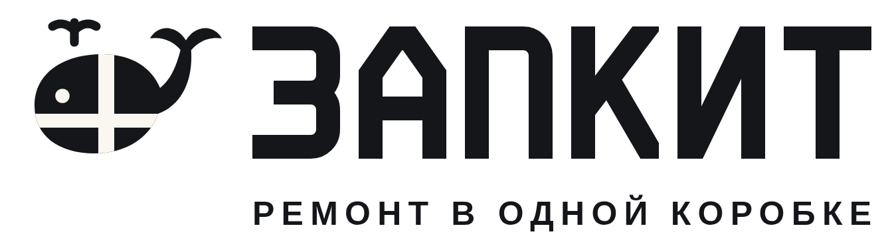

# Бренд ЗАПКИТ

**ЗАПКИТ — ремонт в одной коробке.**

ЗАП + КИТ: запчасти плюс *kit* (англ. «набор»). По-русски «кит» — это кит, отсюда талисман.



## Идея знака

**Кит, перевязанный крест-накрест лентой, как посылка:** кит и есть набор. Фонтанчик над головой добавляет живости. Буквы «ЗАПКИТ» нарисованы геометрией вручную, шрифты не используются, поэтому логотип оригинальный и одинаково выглядит в любом редакторе.

## Файлы

| Файл | Назначение |
|---|---|
| `png/zapkit-avatar-1024.png` | **Аватар магазина на Авито** (жёлтый, лучше всего виден в ленте) |
| `png/zapkit-avatar-dark-1024.png` | Аватар, тёмный вариант (Telegram, VK) |
| `png/avito-cover-1920x640.png` | Обложка магазина на Авито. Размер сверьте при загрузке, главное расположено по центру |
| `png/kit-card-example-1200x900.png` | Образец главного фото для объявления-кита |
| `png/zapkit-mark-512.png` | Знак отдельно: наклейка на коробку, стикеры |
| `png/zapkit-logo-dark.png` | Логотип для светлого фона |
| `png/zapkit-logo-light.png` | Логотип для тёмного фона |
| `png/zapkit-logo-on-yellow.png` | Логотип для жёлтого фона |
| `png/zapkit-lockup-dark.png` / `-light.png` | Логотип со слоганом (карта ремонта, документы, сайт) |
| `svg/*.svg` | Те же файлы в векторе: для печати коробок, наклеек, сайта |

Лента на ките нарисована цветом фона, поэтому каждый вариант логотипа ставьте на свой фон: *dark* на светлый, *light* на графит, *on-yellow* на жёлтый.

## Цвета

| Цвет | HEX | Где |
|---|---|---|
| Жёлтый «скотч» | `#FFC72C` | Главный акцент: аватар, лента, кнопки |
| Графит | `#14161A` | Кит и буквы на светлом, тёмные фоны |
| Тёплый белый | `#FAF7F0` | Светлые фоны, карточки |
| Крафт | `#C8925A` | Коробки, иллюстрации |
| Сталь | `#8C929B` | Второстепенный текст |

## Правила

- Вокруг логотипа оставляйте свободное поле не меньше половины высоты кита.
- Кит всегда смотрит влево, хвостом вверх. Не отражайте и не поворачивайте его.
- Не растягивайте, не добавляйте тени и обводки.
- Талисман можно использовать в контенте («Ваш кит уже плывёт 🐋»), но силуэт знака не меняйте.

## Голос бренда

Дружелюбно, коротко, по делу. Примеры:
- «Всё для замены колодок — в одной коробке».
- «Ваш кит уже плывёт 🐋» (отправлено), «Кит приплыл!» (доставлено).
- «Не хватило детали по нашей вине — довезём бесплатно».

## Как изменить и перегенерировать

```bash
python3 brand/tools/build_brand.py                            # SVG → brand/svg
NODE_PATH=$(npm root -g) node brand/tools/render.js           # PNG → brand/png (нужен playwright)
```

Геометрия кита и букв, цвета, тексты обложки и карточки задаются в `brand/tools/build_brand.py`.
