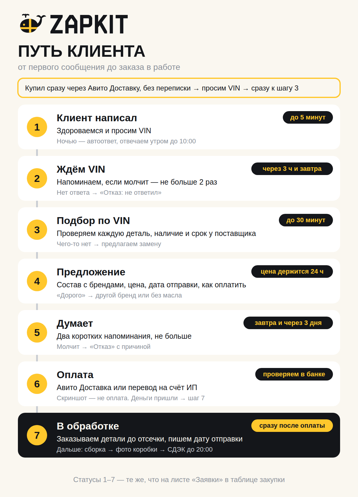

# ZAPKIT: путь клиента — от первого сообщения до заказа в работе

Как мы ведём каждого покупателя на Авито: что делаем на каждом шаге, за сколько времени, что пишем и что делать, если что-то пошло не так.

- Схема для телефона: `avito/png/process-client-loop.png`.
- Учёт обращений: лист **«Заявки»** в `avito/zapkit-zakupka.xlsx`. Статусы там те же, что здесь.
- Этот документ заканчивается на статусе **«7. В обработке»**. Что дальше (закупка, сборка, отправка, отзыв), распишем следующим этапом.

---

## Главные правила

1. **Отвечаем за 5 минут** в рабочее время: **каждый день с 9:00 до 20:00**. Покупатель обычно пишет сразу нескольким продавцам и часто покупает у того, кто ответил первым.
2. **Без проверки по VIN ничего не отправляем.** Даже если клиент купил сразу и уверен в детали — перепроверяем. VIN — основа нашей гарантии «не подошло по нашему подбору — вернём деньги».
3. **Всё общение — только в чате Авито.** Там остаётся VIN, состав и цена, о которых договорились. Если будет спор, это наше доказательство.
4. **Каждое обращение сразу заносим в «Заявки».** Даже если человек спросил и пропал. Иначе через месяц не понять, почему не покупают.
5. **Ни одного клиента без следующего шага.** У каждой открытой заявки есть «что делаем» и «когда». Просроченные таблица подсвечивает оранжевым.

---

## Статусы

| Статус | Что значит | Что делаем | Срок |
|---|---|---|---|
| **1. Новый** | Клиент написал | Здороваемся, просим VIN | до 5 минут |
| **2. Ждём VIN** | Спросили VIN, ответа нет | Напоминаем 2 раза, потом закрываем | через 3 часа и на следующий день |
| **3. Подбор** | VIN есть, проверяем | Каждая деталь по каталогу, наличие и срок у поставщика | до 30 минут |
| **4. Предложение** | Отправили состав и цену | Ждём ответа | цена держится 24 часа |
| **5. Думает** | Не ответил или «подумаю» | 2 напоминания, потом закрываем | завтра и через 3 дня |
| **6. Ждём оплату** | Согласен, выбирает способ оплаты | Проверяем, что деньги пришли | в течение дня |
| **7. В обработке** | Оплачено, заказ наш | Заказываем детали, пишем дату отправки | сразу после оплаты |
| **Отказ** | Не купил | Пишем причину в «Заявки» | — |

---

## Шаг за шагом

### Шаг 1. Клиент написал → «1. Новый»

**Что делаем:** в течение 5 минут отвечаем и просим VIN. Заводим строку в «Заявках»: дата и время, имя на Авито, откуда (чат / купил сразу / звонок), какой кит смотрел, сколько минут ушло на первый ответ.

**Пишем:**

> Здравствуйте! Спасибо, что написали в ZAPKIT. Пришлите, пожалуйста, VIN вашей машины — 17 символов, он есть в СТС. Проверю по нему каждую деталь и сразу напишу, что подходит.

Если клиент сначала задал вопрос («подойдёт на мою?», «а есть на Rio 2015?»):

> Подберём точно по вашей машине — для этого нужен VIN. Пришлите, и в течение получаса отвечу по каждой детали.

**Если написал после 20:00 или до 9:00:** срабатывает автоответ (текст ниже, в разделе «Настроить в Авито»), а утром до 10:00 отвечаем сами.

**Если позвонил:** звонки принимаем в рабочее время. После разговора просим прислать VIN в чат — так он не потеряется, и там же будет предложение.

### Шаг 2. Ждём VIN → «2. Ждём VIN»

**Что делаем:** если VIN не пришёл, напоминаем два раза. После второго напоминания без ответа закрываем: статус «Отказ», причина «не ответил».

**Через 3 часа:**

> Напоминаю про VIN — как пришлёте, сразу проверю кит под вашу машину. Если так проще, сфотографируйте СТС, прикрыв личные данные: мне нужен только VIN.

**На следующий день:**

> Добрый день! Кит под вашу машину ещё нужен? Пришлите VIN — соберу сегодня.

### Шаг 3. Подбор по VIN → «3. Подбор»

**Что делаем (до 30 минут):**
1. Вписываем VIN в «Заявки».
2. Проверяем **каждую** позицию кита по VIN в каталоге поставщика (у Профит Лиги есть «VIN-запрос» в личном кабинете).
3. Смотрим наличие и срок до Сочи. Если чего-то нет, ищем замену у другого поставщика.
4. Сверяем цену с листом «Киты». Если закупка выросла так, что кит уходит в минус, пересчитываем.

Если подбор займёт дольше 15 минут, пишем, чтобы клиент не ушёл:

> Получил VIN, проверяю по каталогу. Напишу в течение 30 минут.

**Если деталь из объявления не подходит или её нет:**

> По вашему VIN <деталь> из объявления не подходит. Поставлю <бренд, артикул> — это та же деталь под вашу машину. Кит будет стоить <цена> ₽. Подходит?

### Шаг 4. Предложение → «4. Предложение»

**Что делаем:** пишем одно сообщение, в котором есть всё: состав с брендами, цена, дата отправки, способы оплаты и срок, сколько держится цена.

> Проверил по VIN — всё подходит. В коробке:
> — <деталь, бренд, артикул>
> — <деталь, бренд, артикул>
> — карта ремонта
>
> Цена <цена> ₽. Отправим СДЭКом <сегодня / завтра> вечером, до 20:00. Перед отправкой пришлю фото собранной коробки. Если вы в Сочи, можно забрать самим — договоримся о месте и времени.
>
> Оплатить можно через Авито Доставку (кнопка «Купить с доставкой» в объявлении) или переводом на счёт ИП — как вам удобнее?
>
> Если хотите другой бренд или оригинал — пересчитаю. Цену держу 24 часа: у поставщиков она меняется.

**Для китов со сроком** (сейчас это Coolray: ремень помпы везём под заказ) дата отправки — через 3 дня. Говорим об этом сразу, в предложении, а не после оплаты.

**Клиент хочет другой бренд или оригинал:** пересчитываем по тому же правилу, что и цены китов — впритык к рынку: складываем розничные цены этих деталей у других продавцов и округляем вниз до …90. Если рынка не найти — закупка × 1,3 плюс 5%. Отправляем новое предложение. Статус остаётся «4. Предложение».

### Шаг 5. Думает → «5. Думает»

**Что делаем:** два коротких напоминания, не больше. Навязчивость отпугивает.

**На следующий день:**

> Добрый день! Держу для вас цену на кит до <время>. Если есть вопросы по составу — отвечу.

**Через 3 дня:**

> Если кит ещё нужен — напишите, пересчитаю по сегодняшним ценам.

Молчит дальше → «Отказ», причина «не ответил». Сказал «дорого» → см. [трудные ситуации](#трудные-ситуации).

### Шаг 6. Оплата → «6. Ждём оплату»

**Авито Доставка** (предлагаем первой: защищает и покупателя, и нас, а цена уже стоит в объявлении):

> Отлично! Оформите, пожалуйста, «Купить с доставкой» в объявлении и выберите удобный пункт СДЭК. Как только заказ придёт, подтвержу его и закажу детали.

**Перевод** (если клиент сам попросил):

> Отлично! Оплатить можно по СБП на счёт ИП: <как настроите в банке — QR-код или номер>. После оплаты пришлю чек и сразу закажу детали. Доставку СДЭК оплачиваете при получении в пункте.

**Самовывоз в Сочи** (если клиент хочет забрать сам): оплата переводом заранее, после проверки VIN, — детали мы заказываем под клиента. Место назначаете вы, время — с 9:00 до 20:00.

> Отлично, забрать можно в Сочи. Оплата переводом по СБП: <реквизиты>. Как только детали приедут и я соберу кит, напишу — договоримся о месте и времени.

**Правила оплаты:**
- **Деньги проверяем в приложении банка.** Скриншот от клиента — не оплата.
- **При переводе отправляем чек** через онлайн-кассу: так требует закон (54-ФЗ).
- **Если цена в предложении отличается от объявления** (другой бренд, оригинал), Авито Доставка возьмёт цену из объявления. Как Авито сейчас позволяет выставить другую цену конкретному покупателю, проверьте в кабинете. Если никак — предлагайте перевод.

### Шаг 7. В обработке → «7. В обработке»

**Заказ считается принятым, только когда выполнены все четыре условия:**
1. VIN проверен, каждая деталь подходит.
2. Состав и цена согласованы письменно в чате.
3. Деньги пришли: заказ Авито Доставки подтверждён или перевод виден в банке.
4. Клиент знает дату отправки.

**Что делаем:**
1. Сразу заказываем детали у поставщика, до его отсечки. Отсечки записаны на листе «Поставщики».
2. Если заказ через Авито Доставку — подтверждаем его в кабинете, в срок, который показывает Авито.
3. В «Заявках» ставим «7. В обработке», сумму и способ оплаты.
4. Пишем клиенту:

> Заказ принят в работу. Детали заказал, отправим <дата> вечером, до 20:00. Перед отправкой пришлю фото собранной коробки и трек-номер.

Для самовывоза:

> Заказ принят в работу. Детали заказал, кит будет готов <дата>. Напишу, как соберу, — договоримся, где и когда встретиться.

---

## Если клиент купил сразу, без переписки

Через Авито Доставку можно купить, не написав ни слова. Тогда нет VIN, и подобрать детали нечем.

1. **Сразу пишем в чат заказа:**

   > Спасибо за заказ! Чтобы проверить каждую деталь под вашу машину, пришлите, пожалуйста, VIN — 17 символов из СТС. Как только проверю, подтвержу заказ и отправлю.

2. Дальше — **шаг 3 (подбор)** и **шаг 7**, предложение и оплата уже не нужны.
3. **Без проверки не отправляем — в любом случае.** Если VIN не присылает, через 3 часа напоминаем и предлагаем варианты: фото СТС (личные данные можно закрыть) или позвонить через Авито и продиктовать.

   > Без VIN не могу гарантировать, что всё подойдёт, а отправлять наугад не хочу. Пришлите, пожалуйста, VIN или фото СТС — проверю за полчаса и сразу отправлю.

4. **Если проверить так и не удалось** до конца срока подтверждения заказа — отменяем заказ и объясняем почему. Лучше отмена, чем коробка, которая не подойдёт и вернётся за наш счёт.

---

## Трудные ситуации

| Ситуация | Что делаем и что пишем |
|---|---|
| **Не знает, где VIN** | «VIN есть в СТС, строка VIN. Ещё он есть внизу лобового стекла слева и на стойке водительской двери.» |
| **Машины нет в списке** | Просим VIN, подбираем, считаем кит как обычно — впритык к рынку (если рынка не найти — закупка × 1,3 плюс 5%). Если одну и ту же машину спрашивают часто — делаем под неё объявление. |
| **«Дорого»** | Скидку с цены не даём. Предлагаем дешевле бренд или кит без масла, если у клиента своё: «Могу собрать на <бренд> — будет <цена> ₽, или без масла — <цена> ₽». Отказался → «Отказ», причина «дорого». |
| **Хочет одну деталь** | Продаём поштучно, если клиент просит. Цену ставим впритык к рознице этой детали у других продавцов (если не найти — закупка × 1,3 плюс 5%). Обязательно спрашиваем, какой ремонт он делает — возможно, ему нужно что-то ещё: «Для какого ремонта деталь? Подскажу, что обычно меняют вместе с ней, чтобы не пришлось заказывать второй раз». Нужно больше — предлагаем кит или добавляем позиции. |
| **«Это оригинал?»** | «У каждой детали в описании указан бренд. Сейчас в ките <бренды>. Любую позицию можно заменить на оригинал — пересчитаю цену.» Слово «оригинал» — только про оригинальные детали. |
| **Спрашивает про установку** | «Установкой не занимаемся — мы интернет-магазин запчастей. Для ГРМ и тормозов советуем сервис, карта ремонта в коробке поможет мастеру.» |
| **Нужно срочно, сегодня** | Только если все детали есть у поставщика в Сочи и мы успеваем до отсечки. Не обещаем то, что не зависит от нас. |
| **Звонит** | Звонки принимаем с 9:00 до 20:00. После разговора просим продублировать VIN в чат: «Чтобы ничего не перепутать, пришлите VIN в чат Авито — там же пришлю состав и цену.» |
| **Хочет забрать сам в Сочи** | Даём. Оплата переводом заранее, после проверки VIN (детали заказываем под клиента). Место назначаете вы, время — с 9:00 до 20:00. В «Заявках» — «перевод + самовывоз». |
| **Зовёт в WhatsApp или Telegram, присылает ссылку «на оплату» или «на доставку»** | Не переходим и ссылки не открываем. Это частая схема мошенников. «Давайте всё в чате Авито — так надёжнее для нас обоих.» |
| **Цена у поставщика выросла после предложения** | В течение 24 часов держим обещанную цену. Позже — честно пересчитываем до оплаты. |
| **Таксопарк, юрлицо, несколько машин** | Оплата по счёту, отдельное предложение: [«Предложение для таксопарков»](templates.md#предложение-для-таксопарков). |

---

## Как вести лист «Заявки»

- **Одна строка — одно обращение.** Номер ставится сам.
- **Откуда:** «чат», «купил сразу» или «звонок».
- **Первый ответ, мин:** сколько минут прошло от сообщения клиента до вашего ответа. Больше 10 минут таблица подсветит красным.
- **Статус:** выбирайте из списка, он совпадает со статусами выше.
- **Следующий шаг и «Когда»:** что сделать и в какой день. Если день наступил, а заявка ещё открыта, строка станет оранжевой.
- **Причина отказа:** обязательно, если статус «Отказ». Справа таблица сама считает, какая причина самая частая.
- **Колонки правее** (трек-номер, дата получения, пробег, напоминание о ТО) заполняются после оплаты — см. [order-loop.md](order-loop.md#как-вести-лист-заявки-на-этом-этапе).

**Справа на листе — воронка:** сколько всего обращений, сколько на каждом статусе, доля заказов, среднее время ответа, выручка по принятым заказам и причины отказов.

**Раз в неделю смотрим:**
- **Доля заказов меньше 20%** — разбираем причины отказов: если «дорого», проверяем цены конкурентов; если «не ответил», ускоряем первый ответ.
- **Среднее время ответа больше 10 минут** — включаем уведомления и шаблоны ответов.
- **Много «Ждём VIN» без движения** — меняем первое сообщение: объясняем, зачем VIN.

---

## Настроить в Авито перед стартом

- [ ] **Уведомления о сообщениях** в приложении Авито на телефоне, со звуком.
- [ ] **Рабочие часы** в профиле магазина: каждый день 9:00–20:00.
- [ ] **Звонки** включены на те же часы (если Авито позволяет задать время звонков).
- [ ] **Автоответ на нерабочее время** (в настройках сообщений; если такого пункта нет в вашем тарифе, уточните в поддержке Авито):

  > Здравствуйте! Это ZAPKIT. Мы на связи каждый день с 9:00 до 20:00 — ответим утром до 10:00. Чтобы не терять время, пришлите VIN вашей машины — к утру подберём кит.

- [ ] **Шаблоны ответов:** сохраните сообщения из шагов 1, 2, 4, 6 и 7. Если шаблонов в тарифе нет, держите их в заметках телефона.
- [ ] **Авито Доставка включена во всех объявлениях**, указаны вес и размер коробки. Ориентиры: ТО-кит ≈ 5 кг, тормоз-кит ≈ 10–11 кг (два диска), ГРМ-кит ≈ 2 кг. Взвесьте первую собранную коробку каждого вида и поправьте.
- [ ] **Оплата переводом:** QR-код СБП или номер для переводов на счёт ИП и онлайн-касса для чеков — настраиваются в банке.
- [ ] **Обложка магазина:** с подпиской её уже можно поставить, файлы готовы — `brand/png/avito-cover-*.png`.

---

## Что решили

| Вопрос | Решение |
|---|---|
| Рабочие часы | Каждый день **9:00–20:00**. В остальное время — автоответ, утром отвечаем до 10:00 |
| Звонки | Принимаем в рабочие часы. VIN, состав и цену всё равно фиксируем в чате |
| Купил сразу, без VIN | **В любом случае перепроверяем.** Без проверки не отправляем; не удалось проверить — отменяем заказ |
| Детали поштучно | Продаём по просьбе клиента и спрашиваем, какой ремонт он делает: возможно, ему нужно что-то ещё |
| Самовывоз в Сочи | **Даём.** Оплата переводом заранее, место — ваше, время — 9:00–20:00 |

---

## Что дальше

Следующий этап — **от «В обработке» до отзыва и повторной покупки** — расписан в [order-loop.md](order-loop.md): приёмка и проверка деталей, сборка коробки, фото клиенту, отправка или встреча, получение, отзыв, проблемы и напоминание о следующем ТО.
