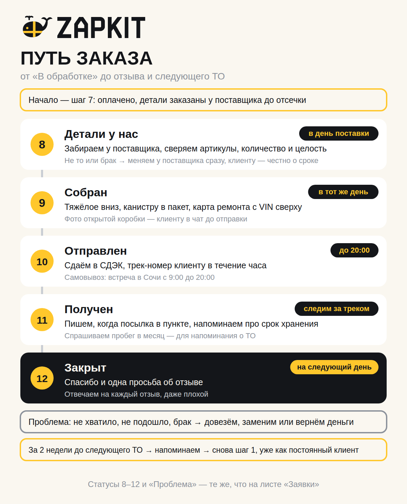

# ZAPKIT: путь заказа — от «В обработке» до отзыва и следующего ТО

Что происходит после оплаты: приёмка деталей, сборка, отправка или встреча, получение, отзыв, проблемы и повторная покупка. Продолжение [пути клиента](client-loop.md).

- Схема для телефона: `avito/png/process-order-loop.png`.
- Учёт — тот же лист **«Заявки»** в `avito/zapkit-zakupka.xlsx`, та же строка клиента: меняем статус и заполняем колонки справа.

---

## Главные правила

1. **Клиент всегда знает, где его заказ.** Мы пишем сами на каждом шаге, не дожидаясь вопроса «ну что там?».
2. **Проверяем детали до сборки, а не после жалобы.** Ошибку дешевле поймать у поставщика, чем возвращать из другого города.
3. **Отправляем день в день.** Детали у нас до вечера — коробка в СДЭК до 20:00.
4. **Фото открытой коробки — до отправки.** Клиенту это спокойствие, нам — доказательство, что всё было на месте.
5. **Свою ошибку исправляем быстро.** Довезём, заменим или вернём деньги — решение за сутки.

---

## Статусы

| Статус | Что значит | Что делаем | Срок |
|---|---|---|---|
| **7. В обработке** | Оплачено, детали заказаны | Ждём поставку | по сроку поставщика (обычно 1 день, ремень помпы Coolray — 3 дня) |
| **8. Детали у нас** | Забрали и проверили | Собираем | в день поставки |
| **9. Собран** | Коробка собрана, фото у клиента | Везём в СДЭК или на встречу | в тот же день |
| **10. Отправлен** | Сдали в СДЭК или назначили встречу | Трек-номер клиенту, следим за доставкой | трек — в течение часа |
| **11. Получен** | Клиент забрал | Спрашиваем пробег, благодарим | в день получения |
| **12. Закрыт** | Попросили отзыв | Ждём следующее ТО | на следующий день после получения |
| **Проблема** | Не хватило, не подошло, брак, повреждено | Решаем за сутки | см. [проблемы](#проблемы-не-хватило-не-подошло-брак) |

---

## Шаг за шагом

### Шаг 8. Приёмка деталей → «8. Детали у нас»

**Когда заказываем у поставщика** (это ещё шаг 7): сверяем артикулы в корзине с предложением клиента и в «Заявках» пишем следующий шаг — «забрать детали» и дату.

**Поставщик задержал или отменил позицию** — пишем клиенту сразу, а не в день отправки:

> Поставщик задерживает <деталь> до <даты>. Могу поставить <бренд, артикул> — тогда отправим сегодня. Или ждём до <даты>. Как вам удобнее?

Клиент не согласен ни на то, ни на другое — возвращаем деньги.

**Проверяем при получении у поставщика, не отходя от стойки:**
- [ ] Бренды и артикулы — те же, что в предложении клиенту.
- [ ] Количество: диски — 2 шт., в комплекте ГРМ — все ролики по описанию комплекта.
- [ ] Упаковка целая: без вмятин и следов вскрытия.
- [ ] Канистра масла: крышка с пломбой, нет подтёков.
- [ ] Диски и колодки: без трещин и сколов.

Что-то не так — меняем прямо у поставщика. Потом это сделать сложнее.

### Шаг 9. Сборка → «9. Собран»

**Как укладывать:**
1. **Коробка по размеру**, чтобы ничего не болталось. Ориентиры: ТО-кит — средняя, тормоз-кит — плотная средняя (диски тяжёлые, ≈ 10–11 кг), ГРМ-кит — маленькая.
2. **Тяжёлое вниз.** Канистру — в плотный пакет, завязать: если протечёт, не зальёт фильтры. Диски — на дно, каждый завернуть в картон или плёнку.
3. **Лёгкое сверху.** Фильтры, ремни, колодки — не мять и не класть под тяжёлое.
4. **Пустоты заполнить** бумагой или картоном.
5. **Карта ремонта сверху:** вписать VIN, отметить галочками всё, что положили.

**Фото клиенту:** открытая коробка, видна каждая деталь и карта ремонта сверху.

> Ваш кит собран 🐋 Вот что внутри — проверьте, пожалуйста, всё ли как договаривались. Сегодня вечером отправляю.

**Закрываем:** жёлтый скотч крестом — как на ките в нашем логотипе — и наклейка ZAPKIT (`avito/png/print-stickers-a4.png`, печатается на А4). Взвешиваем и меряем коробку — это нужно для отправки.

### Шаг 10. Отправка или встреча → «10. Отправлен»

**Авито Доставка:** в заказе на Авито есть инструкция, как сдать посылку в СДЭК. Сдаём в пункт до 20:00, в срок, который указан в заказе.

**Перевод + СДЭК:** оформляем отправку сами — в приложении или на сайте СДЭК. Доставку оплачивает покупатель при получении (так заложено в наших расчётах), и мы говорим ему об этом ещё в предложении.

**В обоих случаях:** фотографируем сданную коробку и квитанцию, трек-номер пишем в «Заявки» и отправляем клиенту в течение часа:

> Ваш кит уже плывёт 🐋 Трек-номер: <номер>. Отследить можно в приложении СДЭК или на Авито. Напишу, когда посылка будет в пункте.

**Самовывоз в Сочи:** договариваемся о месте и времени (с 9:00 до 20:00), за 2 часа до встречи напоминаем. На встрече открываем коробку и показываем всё по карте ремонта — оплата уже была переводом.

> Кит собран и ждёт вас 🐋 Удобно встретиться <место> <день> в <время>?

В «Заявках» в колонку «Трек-номер / встреча» пишем место и время.

### Шаг 11. Доставка и получение → «11. Получен»

- **Следим за треком.** Если посылка задерживается больше чем на 2 дня против срока — пишем в поддержку СДЭК и предупреждаем клиента.
- **Посылка в пункте** — пишем клиенту. Срок хранения в пункте ограничен, поэтому за день до конца напоминаем ещё раз:

  > Ваш кит приплыл в пункт СДЭК 🐋 Забрать можно до <даты>. Если коробка помята — вскройте её при сотруднике пункта, чтобы сразу составить акт.

- **Клиент забрал:** ставим «11. Получен» и дату в колонку «Получен (дата)». Для ТО-китов спрашиваем пробег — от него таблица посчитает, когда напомнить о следующем ТО:

  > Рад, что всё дошло! Подскажите, примерно сколько вы проезжаете в месяц? Напомню, когда подойдёт следующее ТО, — соберу такой же кит, VIN у меня уже есть.

  Не хочет говорить — не страшно: таблица напомнит через 6 месяцев.

- **Деньги Авито Доставки** Авито переводит после того, как покупатель подтвердит получение (или автоматически через срок, который указан в правилах Авито). Проверяйте поступление в кабинете.

### Шаг 12. Отзыв → «12. Закрыт»

**На следующий день после получения** — одно сообщение:

> Спасибо, что выбрали ZAPKIT! Если всё подошло и пришло целым, оставьте, пожалуйста, отзыв на Авито — для небольшого магазина это очень важно. А если что-то не так — напишите, решим.

- **Просим один раз.** Если клиент ставит детали позже, можно одно мягкое напоминание через неделю.
- **Не предлагаем скидку или подарок за отзыв:** это похоже на накрутку, а за накрутку Авито наказывает.
- **Отвечаем на каждый отзыв** публично. На хороший — коротко спасибо. На плохой — спокойно, по фактам и с решением:

  > Спасибо, что написали. <Что случилось, без оправданий.> Мы <что сделали или предлагаем>. Если вопрос ещё открыт — напишите в чат, решим.

**После ГРМ- или тормоз-кита** в сообщении с благодарностью можно один раз упомянуть ТО-кит на эту же машину. Больше не напоминаем — это уже спам.

---

## Проблемы: не хватило, не подошло, брак

Статус **«Проблема»** (таблица подсветит строку красным). Отвечаем в течение часа, решение — за сутки. Расходы записываем в «Комментарий»: раз в месяц сверяем их с резервом 5% на листе «Параметры».

| Что случилось | Что делаем | Кто платит доставку |
|---|---|---|
| **Не хватило детали по нашей вине** | Довозим бесплатно: заказываем в тот же день и отправляем СДЭКом | мы |
| **Не подошло по нашему подбору** | Меняем на подходящую или возвращаем деньги. Деталь возвращаем поставщику по его условиям (лист «Поставщики», колонка про возврат) | мы — в обе стороны |
| **Брак** | Клиент присылает фото, возвращает деталь — отправляем замену через гарантию поставщика. Замены нет — возвращаем деньги | мы |
| **Повреждено в доставке** | Клиент составляет акт в пункте СДЭК при получении, мы подаём претензию в СДЭК (или через Авито, если была Авито Доставка) и отправляем замену | СДЭК по претензии |
| **Клиент передумал или сам дал неверные данные** | По закону при покупке на расстоянии покупатель может вернуть товар в течение 7 дней после получения, если сохранены товарный вид и упаковка (ст. 26.1 Закона «О защите прав потребителей»). Деньги возвращаем за вычетом расходов на обратную доставку. Вскрытую канистру масла не принимаем — товарный вид не сохранён | покупатель |

Если заказ был через **Авито Доставку**, возврат оформляется в самом заказе на Авито — действуем по его правилам.

**Пишем клиенту, когда ошибка наша:**

> Извините, это наша ошибка. <Решение: довезём / заменим / вернём деньги> — сегодня же <что делаем>. Напишу, как только отправлю.

---

## Повторная покупка

**ТО повторяется** — это главный источник постоянных клиентов.

1. **Таблица сама считает дату** в колонке «Напомнить о ТО»: дата получения плюс интервал ТО (10 000 км, меняется на листе «Параметры»), делённый на пробег клиента в месяц, минус 2 недели. Не позже чем через год; без пробега — через 6 месяцев.
2. **Раз в неделю** смотрим на жёлтые строки: у них подошёл срок напоминания. Их число видно справа — «Пора напомнить о ТО».
3. **Пишем:**

   > Здравствуйте! В <месяц> вы брали у нас ТО-кит на <машину>. По вашему пробегу скоро следующее ТО — собрать такой же? VIN у меня есть, цену пришлю за 5 минут.

4. **Клиент согласился** — заводим новую строку, «Откуда» — «повторный», и сразу переходим к шагу 3 (подбор): VIN уже известен.
5. **Не ответил** — больше не пишем до следующего срока.

---

## Как вести лист «Заявки» на этом этапе

| Колонка | Что вписывать |
|---|---|
| **Статус** | 7 → 8 → 9 → 10 → 11 → 12, или «Проблема» |
| **Следующий шаг и «Когда»** | Например: «забрать детали» — завтра; «напомнить про срок хранения» — дата. Просроченное подсветится оранжевым, пока заказ не закрыт |
| **Трек-номер / встреча** | Номер СДЭК или место и время встречи |
| **Получен (дата)** | День, когда клиент забрал |
| **Пробег в месяц, км** | Со слов клиента |
| **Напомнить о ТО** | Считается сам, не трогать |
| **Комментарий** | Для «Проблемы» — что случилось и сколько стоило решение |

Справа на листе: число заказов (статусы 7–12 и «Проблема»), выручка, повторные обращения и сколько клиентам пора напомнить о ТО.

**Раз в неделю смотрим:**
- **Доля «Проблем» больше 3% заказов** — проверяем приёмку и сборку: скорее всего, ошибка повторяется.
- **Есть заказы, которые висят на 8–9 дольше дня** — ищем, где тормозит: поставщик или сборка.
- **Отзывов меньше половины от закрытых заказов** — пересматриваем сообщение с просьбой об отзыве.

---

## Подготовить до первого заказа

- [ ] **Коробки** трёх размеров (маленькие для ГРМ, средние для ТО, плотные средние для тормозов). Продаются в пунктах СДЭК, дешевле — оптом на маркетплейсах.
- [ ] **Жёлтый скотч** — фирменный цвет, крест на коробке.
- [ ] **Наклейки ZAPKIT** — `avito/png/print-stickers-a4.png`, печать на самоклейке А4.
- [ ] **Карты ремонта** — листы А4 по 4 карты (`avito/png/print-repair-cards-a4-*.png`).
- [ ] **Плотные пакеты** для канистр, бумага или картон для пустот, плёнка для дисков.
- [ ] **Весы и рулетка** — вес и размер коробки нужны для отправки.
- [ ] **Приложение СДЭК** с входом по номеру ИП — для отправок при оплате переводом.

Когда купите упаковку, посчитайте реальную стоимость на один кит и поправьте «Упаковку на 1 кит» на листе «Параметры» (сейчас там 50 ₽ — оценка).

---

## Что решить вам

1. **Скидка постоянным клиентам.** Предлагаю без скидки: вместо неё — «VIN уже есть, соберу за 5 минут». Маржа на ТО-китах и так небольшая.
2. **Доставка при оплате переводом.** Сейчас в расчётах её оплачивает покупатель при получении. Если решите отправлять бесплатно — скажите, впишу среднюю стоимость в «Параметры», и таблица пересчитает прибыль.
