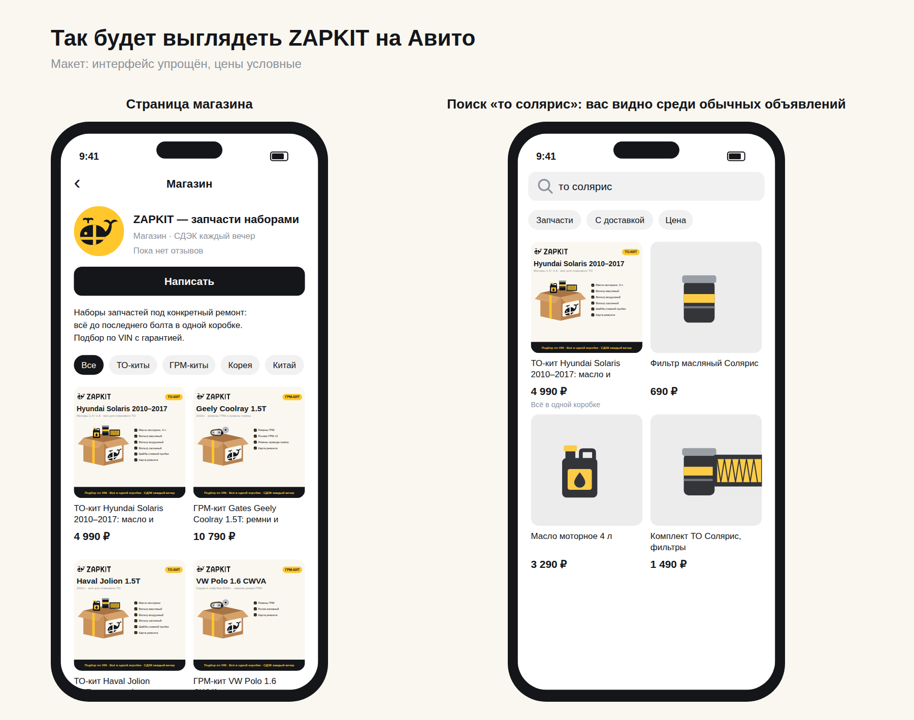
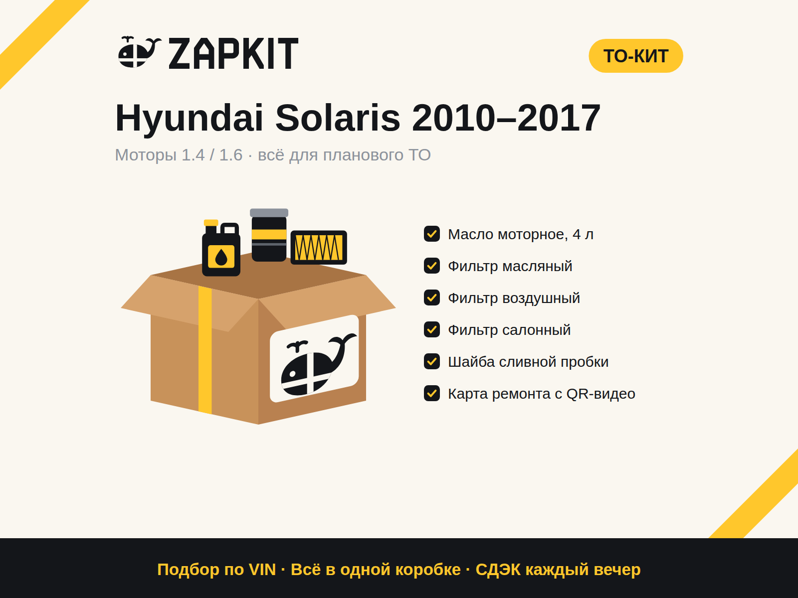

# ZAPKIT: запуск на Авито шаг за шагом

Простыми словами: что делаем, в каком порядке, сколько это стоит и как всё будет выглядеть.

> **Коротко об идее.** Мы продаём не отдельные запчасти, а **наборы («киты») под конкретный ремонт**: всё для ТО, всё для замены колодок и так далее. В одной коробке всё до последнего болта. Склада нет: покупатель заказывает, мы покупаем у поставщика, собираем коробку и отправляем.

---

## Что уже готово

| Что | Файл | Зачем |
|---|---|---|
| Логотип и фирменный стиль | `brand/png/zapkit-brand-board.png` | Все варианты логотипа, цвета, правила на одном листе |
| Аватар магазина | `brand/png/zapkit-avatar.png` | Загружается в профиль Авито |
| Фото для всех 27 наборов | `avito/png/to-*.png`, `avito/png/grm-*.png`, `avito/png/trm-*.png` | Главное фото и фото «Что в коробке» |
| Таблица закупки и цен | `avito/zapkit-zakupka.xlsx` | Составы, цены 9 поставщиков, автоматическая цена кита |
| Стартовый ассортимент и Сочи | [assortment.md](assortment.md) | Машины, моторы, порядок выкладки |
| Два общих фото для всех объявлений | `avito/png/common-3-guarantees.png`, `common-4-how-to-order.png` | Гарантии и «как заказать» |
| Карта ремонта для печати (А6) | `avito/png/print-repair-card-*.png` | Вкладыш в коробку |
| Наклейки для печати (А4, 12 шт.) | `avito/png/print-stickers-a4.png` | Клеим на любую коробку, и она становится фирменной |
| Макет магазина | `avito/png/mockup-avito-store.png` | Как всё будет выглядеть на телефоне |
| Тексты объявлений | [listings.md](listings.md) | Копируете и вставляете |
| Путь клиента: от сообщения до заказа | [client-loop.md](client-loop.md) | Статусы, сроки, что писать, трудные ситуации |
| Путь заказа: от оплаты до отзыва и следующего ТО | [order-loop.md](order-loop.md) | Приёмка, сборка, отправка, проблемы, повторные покупки |
| Обложки магазина | `brand/png/avito-cover-*.png` | Понадобятся позже, с подпиской Авито Pro |

---

## Что нужно прямо сейчас и сколько это стоит

**Честно:** совсем без денег на Авито в 2026 году не начать. Размещение для частников в «Запчастях» платное (бесплатно 1–3 объявления в месяц), а у бизнеса оплачиваются просмотры. Но вложения минимальные, и бо́льшая часть возвращается с первым же заказом.

| Что | Сколько | Когда |
|---|---|---|
| Подготовка: выбор машин, составы наборов, цены, тексты, фото | **0 ₽** | Сейчас (шаги 1–7) |
| Регистрация ИП и расчётный счёт | **0 ₽**: онлайн через Госуслуги, сайт налоговой или банк; счёт на бесплатном тарифе | Шаг 8 |
| Баланс Авито на оплату просмотров | **1–3 тыс. ₽** на тест (минимальную сумму покажет кабинет) | Шаг 10 |
| Печать карт ремонта и наклеек | **50–150 ₽** (дома или в копицентре) | Перед первым заказом |
| Закупка деталей под первый заказ | **4–8 тыс. ₽**. Они **вернутся** вместе с прибылью, когда покупатель получит посылку | Первый заказ |
| Взносы ИП | около **4 800 ₽ за каждый месяц** с даты регистрации; за 2026 год платятся до 28 декабря | Из первой прибыли |

**Итого на старт: около 5–10 тыс. ₽**, из них 4–8 тыс. — оборотные деньги, которые возвращаются.

**Ещё понадобится:**
- телефон с приложением Авито;
- подтверждённая учётная запись на Госуслугах (для ИП);
- 1–2 часа в день;
- место дома под 5–10 коробок.

---

## Этап 1. Подготовка (0 ₽, 3–5 дней)

### Шаг 1. Выбрать машины ✅
Решено: **Hyundai Solaris, Kia Rio, VW Polo** и китайские **Haval Jolion, Haval F7, Chery Tiggo 7 Pro / 4 Pro, Geely Coolray**. Моторы и годы расписаны в [assortment.md](assortment.md).

### Шаг 2. Выбрать наборы ✅
Решено: **ТО-кит** (масло, фильтры масляный, воздушный и салонный, шайба) и **ГРМ-кит** (комплект цепи или ремня, помпа и маслонасос — если требуется). Позже добавили **тормоз-кит** (передние диски, колодки, смазка направляющих). Всего 27 китов: 14 ТО, 11 ГРМ и 2 тормоз-кита.

### Шаг 3. Выбрать 2–3 основных поставщика
У вас 9 поставщиков. Выберите 2–3 основных: у кого есть склад или пункт выдачи в Сочи или Адлере, весь ассортимент для кита сразу и нормальные условия возврата. Как сравнить за вечер, описано в [assortment.md → раздел 5](assortment.md#5-поставщики-как-выбрать-23-основных). Оптовые цены обычно дают после оформления ИП (шаг 8), поэтому пока смотрим розницу, чтобы прикинуть.

### Шаг 4. Заполнить таблицу закупки
Откройте `avito/zapkit-zakupka.xlsx`. Все 27 китов уже разложены по позициям. Для каждой позиции подберите по VIN или модели в каталоге поставщика бренд и артикул и впишите цены у тех поставщиков, где она есть. Лучшую цену и поставщика таблица найдёт сама.

### Шаг 5. Посчитать цену
**Это делает таблица:** цена кита — **впритык к рынку**: сумма типичных розничных цен тех же деталей у других продавцов, округлённая вниз до …90 (например, 4 090 ₽ у Kia Picanto). Её вписывают в колонку Y на листе «Киты». Пока рынок не проверен, таблица считает закупка × 1,3, сверху +5%, с округлением до …90. Впишите минимальную цену конкурентов на Авито, и таблица покажет, не дороже ли вы рынка. Если дороже, меняйте бренды или сделайте вариант «без масла».

### Шаг 6. Фото ✅
Фото готовы для всех 27 китов (`avito/png/`). Если реальный состав кита будет отличаться (например, добавите помпу), скажите мне, и я перегенерирую фото за пару минут.

### Шаг 7. Подготовить тексты
Все 25 заголовков и шаблоны описаний ТО- и ГРМ-китов лежат в [listings.md](listings.md).

---

## Этап 2. Запуск (1–3 тыс. ₽, 1–2 дня)

### Шаг 8. Оформить ИП
Только **сейчас, когда всё готово**, а не раньше: взносы считаются с даты регистрации.
- Регистрация онлайн через Госуслуги, сайт налоговой или банк бесплатная ([nalog.ru](https://service.nalog.ru/gosreg/intro.html)).
- Налог: **УСН «доходы минус расходы»** (обычно 15%). Для перепродажи это выгоднее, чем 6%.
- Самозанятость не подходит: при ней перепродавать товары запрещено.
- Откройте расчётный счёт на бесплатном тарифе.
- Зарегистрируйтесь у поставщиков как ИП, чтобы получить оптовые цены. Пересчитайте цены китов.

### Шаг 9. Оформить профиль на Авито

| Поле | Что вставить |
|---|---|
| Тип профиля | Компания или ИП |
| Название | **ZAPKIT — запчасти наборами** |
| Аватар | `brand/png/zapkit-avatar.png` (жёлтый с китом) |
| Описание | Текст из [listings.md → «Описание магазина»](listings.md#описание-магазина) |
| Доставка | Включить **Авито Доставку** |
| Часы ответа | Каждый день 9:00–20:00 |

**Обложку магазина** Авито даёт ставить только с подпиской. Вы подключаете тариф за 6 000 ₽ в месяц, так что ставьте сразу: файлы лежат в `brand/png/avito-cover-*.png`.

### Шаг 10. Выложить первые объявления (неделя 1: 14 ТО-китов)
Каждое объявление собирается так:

**Фото (4 штуки, по порядку):**

1. **Главное** `avito/png/kit-..-1-main.png`: машина крупно, коробка, состав.
2. **Что в коробке** `avito/png/kit-..-2-inside.png`: каждая деталь с иконкой.
3. **3 гарантии** `avito/png/common-3-guarantees.png`, одинаковое для всех.
4. **Как заказать** `avito/png/common-4-how-to-order.png`, одинаковое для всех.

После первого заказа добавьте **5-е фото: реальную собранную коробку**. Это сильно повышает доверие.

**Заголовок** — по формуле «Название кита + машина + главное содержимое», до ~50 символов:
`ТО-кит Hyundai Solaris 1.6: масло и 3 фильтра`

**Цена** — посчитанная на шаге 5.

**Параметры** — заполняйте всё, что просит Авито: состояние «новое», марка и модель, производитель. Номер детали указывайте для главной детали кита, например масляного фильтра. Названия полей в форме могут немного отличаться.

**Описание** — готовый текст из [listings.md](listings.md) с вашими брендами и артикулами.

Пополните баланс для оплаты просмотров. На тест хватит 1–3 тыс. ₽, точные условия покажет кабинет.

**Так это будет выглядеть** (`avito/png/mockup-avito-store.png`):

**Главное фото объявления** (`avito/png/to-01-solaris-2010-1-main.png`):

> **Важно про фото.** В ленте на телефоне Авито обрезает фото до квадрата по центру. Поэтому название машины и коробка на карточках стоят в центре, а по краям только декоративные полосы. Используйте только свои фото и эти карточки: чужие фото из интернета Авито запрещает. Телефоны и ссылки на фото тоже нельзя.

---

## Этап 3. Первые заказы

### Шаг 11. Отвечать быстро
Цель — ответ **за 5 минут** в часы работы. Весь путь клиента с готовыми сообщениями на каждом шаге расписан в [client-loop.md](client-loop.md) (до оплаты) и [order-loop.md](order-loop.md) (после оплаты), обращения ведите на листе «Заявки» в таблице. Всегда просите **VIN**: по нему вы проверяете каждую деталь.

### Шаг 12. Что делать, когда пришёл заказ
1. **Покупатель оплатил через Авито Доставку.** Деньги у Авито, вы получите их после того, как покупатель заберёт посылку.
2. **Проверьте по VIN** каждую деталь кита в каталоге поставщика.
3. **Закажите детали** у поставщика до его отсечки (обычно до обеда, тогда привезут завтра).
4. **Заберите детали** и сверьте с картой ремонта: всё ли на месте, те ли артикулы.
5. **Соберите коробку.** На старте подойдёт любая чистая коробка (можно из-под деталей) плюс **наша наклейка** и **распечатанная карта ремонта**. Впишите в карту VIN, бренды и артикулы от руки.
6. **Сфотографируйте собранный кит** и отправьте фото покупателю в чат.
7. **Сдайте в пункт приёма** Авито Доставки и напишите покупателю: «Ваш кит уже плывёт 🐋».
8. **После получения** деньги придут вам. Попросите отзыв.

### Шаг 13. Раз в неделю смотреть на цифры
- **Просмотры есть, а сообщений нет:** меняйте заголовок, главное фото или цену.
- **Сообщения есть, а заказов нет:** отвечайте быстрее, пересмотрите цену.
- **Заказы есть:** делайте такой же кит на соседние машины.

Таблица для учёта есть в [templates.md → «Метрики на неделю»](templates.md#метрики-на-неделю).

---

## Этап 4. Рост (из прибыли, с 2–3-го месяца)

### Шаг 14. Расширяться
- Больше машин (Creta, Sportage, Rapid, Focus, Haval, Chery, Geely) и больше видов китов. Цель — 50 объявлений.
- **Автозагрузка объявлений** по фиду (работает с подпиской), когда объявлений станет много.
- Коробки с печатью логотипа, когда будет от ~100 заказов в месяц.

### Шаг 15. Искать постоянных клиентов
- **Таксопарки:** ТО-киты по подписке, оплата по счёту ([готовое предложение](templates.md#предложение-для-таксопарков)).
- **Гаражные сервисы:** кит под заказ-наряд, 5% за приведённого клиента.
- **Видео:** распаковка коробки с китом для VK Клипов и YouTube Shorts.

Подробный план на 90 дней, экономика и где взять деньги на рекламу (гранты, соцконтракт, бонусы площадок) описаны в [launch-plan.md](launch-plan.md).

---

## Частые вопросы

**Можно начать как частное лицо, без ИП?**
Для 1–2 пробных объявлений технически можно. Но постоянная перепродажа запчастей — это бизнес, и для неё нужен ИП. К тому же у частников в «Запчастях» бесплатно всего 1–3 объявления в месяц, и Авито быстро переводит активных продавцов в платные.

**Где брать фото, если деталей нет на руках?**
Карточки, которые я делаю, нарисованы с нуля, и их можно использовать. После первого заказа добавьте реальное фото собранной коробки.

**Что если поставщик не привезёт деталь?**
Проверяйте наличие **до** того, как покупатель оплатит, и держите 2 поставщика. Если деталь всё равно не пришла, честно напишите покупателю и предложите замену или отмену.

**Сколько объявлений выкладывать сначала?**
9–10. Лучше 10 хороших, чем 100 пустых: каждый просмотр стоит денег.

**А если в коробке чего-то не хватит?**
Это наша гарантия: довозим бесплатно. Поэтому перед упаковкой всегда сверяйтесь с картой ремонта.

---

## Что нужно от вас, чтобы продолжить

Машины, город (Сочи), поставщики и составы китов уже определены. Дальше:

1. **Заполните таблицу** `avito/zapkit-zakupka.xlsx`: сначала лист «Поставщики» и цены для TO-01 и TO-07 (как — в [assortment.md](assortment.md)).
2. **Скажите, если состав какого-то кита отличается** от моего (например, в ГРМ-ките будет помпа). Я перегенерирую фото.
3. **Следующий вид кита** для Сочи: горные дороги быстро съедают тормоза, поэтому логично добавить тормоз-кит. Скажите, когда будете готовы.
