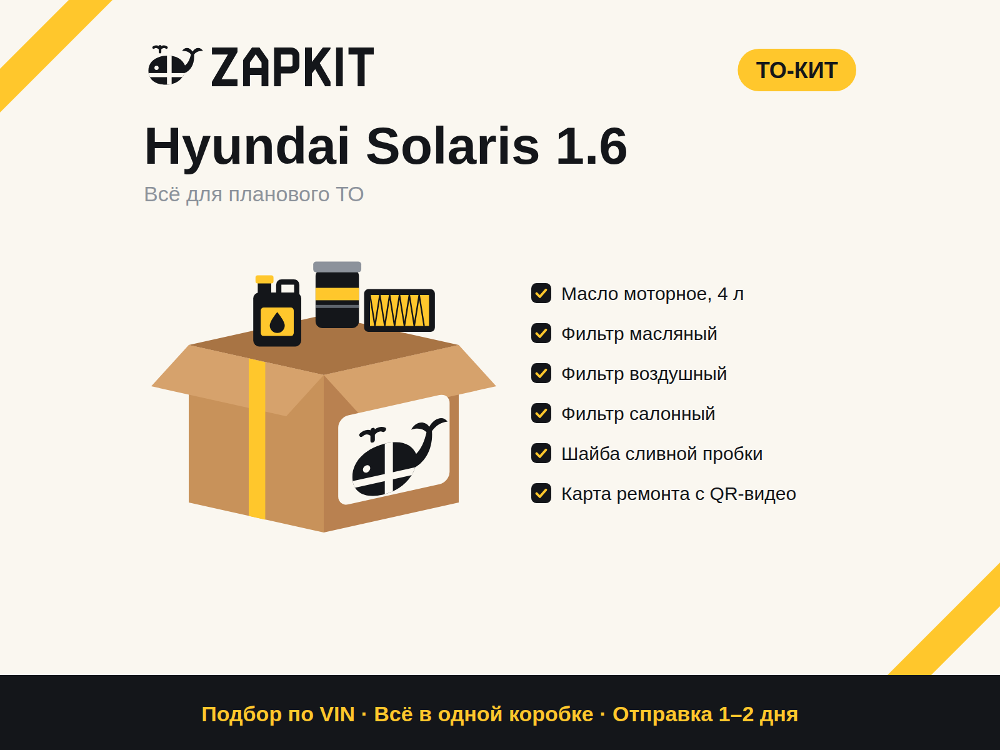

# ZAPKIT: запуск на Авито шаг за шагом

Простыми словами: что делаем, в каком порядке, сколько это стоит и как всё будет выглядеть.

> **Коротко об идее.** Мы продаём не отдельные запчасти, а **наборы («киты») под конкретный ремонт**: всё для ТО, всё для замены колодок и так далее. В одной коробке всё до последнего болта. Склада нет: покупатель заказывает, мы покупаем у поставщика, собираем коробку и отправляем.

---

## Что уже готово

| Что | Файл | Зачем |
|---|---|---|
| Логотип и фирменный стиль | `brand/png/zapkit-brand-board.png` | Все варианты логотипа, цвета, правила на одном листе |
| Аватар магазина | `brand/png/zapkit-avatar.png` | Загружается в профиль Авито |
| Фото для 4 примеров наборов | `avito/png/kit-*.png` | Главное фото и фото «Что в коробке» |
| Два общих фото для всех объявлений | `avito/png/common-3-guarantees.png`, `common-4-how-to-order.png` | Гарантии и «как заказать» |
| Карта ремонта для печати (А6) | `avito/png/print-repair-card-*.png` | Вкладыш в коробку |
| Наклейки для печати (А4, 12 шт.) | `avito/png/print-stickers-a4.png` | Клеим на любую коробку, и она становится фирменной |
| Макет магазина | `avito/png/mockup-avito-store.png` | Как всё будет выглядеть на телефоне |
| Тексты объявлений | [listings.md](listings.md) | Копируете и вставляете |
| Обложки магазина | `brand/png/avito-cover-*.png` | Понадобятся позже, с подпиской Авито Pro |

---

## Что нужно прямо сейчас и сколько это стоит

**Честно:** совсем без денег на Авито в 2026 году не начать. Размещение для частников в «Запчастях» платное (бесплатно 1–3 объявления в месяц), а у бизнеса оплачиваются просмотры. Но вложения минимальные, и бо́льшая часть возвращается с первым же заказом.

| Что | Сколько | Когда |
|---|---|---|
| Подготовка: выбор машин, составы наборов, цены, тексты, фото | **0 ₽** | Сейчас (шаги 1–7) |
| Регистрация ИП и расчётный счёт | **0 ₽**: онлайн через Госуслуги, сайт налоговой или банк; счёт на бесплатном тарифе | Шаг 8 |
| Баланс Авито на оплату просмотров | **1–3 тыс. ₽** на тест (минимальную сумму покажет кабинет) | Шаг 10 |
| Печать карт ремонта и наклеек | **50–150 ₽** (дома или в копицентре) | Перед первым заказом |
| Закупка деталей под первый заказ | **4–8 тыс. ₽**. Они **вернутся** вместе с прибылью, когда покупатель получит посылку | Первый заказ |
| Взносы ИП | около **4 800 ₽ за каждый месяц** с даты регистрации; за 2026 год платятся до 28 декабря | Из первой прибыли |

**Итого на старт: около 5–10 тыс. ₽**, из них 4–8 тыс. — оборотные деньги, которые возвращаются.

**Ещё понадобится:**
- телефон с приложением Авито;
- подтверждённая учётная запись на Госуслугах (для ИП);
- 1–2 часа в день;
- место дома под 5–10 коробок.

---

## Этап 1. Подготовка (0 ₽, 3–5 дней)

### Шаг 1. Выбрать 3 машины для старта
Рекомендую **Hyundai Solaris, Kia Rio и VW Polo седан**. Это одни из самых массовых машин, их много в такси, а каталоги запчастей для них простые. Меньше моделей — меньше ошибок на старте.

### Шаг 2. Выбрать 3 набора на каждую машину
**ТО-кит, Тормоз-кит (перед) и Стабилизатор-кит.** Получается 9 объявлений. Десятым можно добавить сезонный **Зима-кит**: сейчас осень, и он особенно актуален.

### Шаг 3. Зарегистрироваться у поставщиков
Зарегистрируйтесь как покупатель на сайтах 2–3 крупных поставщиков запчастей (у вас они уже есть) и посмотрите цены и наличие. Оптовые цены обычно дают после оформления ИП, это шаг 8. Пока смотрим розницу, чтобы прикинуть.

### Шаг 4. Составить каждый набор
Для каждого кита выпишите в таблицу:
- деталь (например, «фильтр масляный»);
- бренд и артикул (подбор по модели или VIN в каталоге поставщика);
- закупочную цену;
- мелочи, без которых работу не сделать: шайбу сливной пробки, гайки, смазку.

Шаблон таблицы есть в [templates.md → «Отбор ассортимента»](templates.md#отбор-ассортимента).

### Шаг 5. Посчитать цену
**Цена кита = закупка × 1,3**, округлить до …90 ₽ (например, 4 690 ₽). Проверка: цена кита должна быть **не выше**, чем если покупать эти же детали по отдельности на Авито. Если выше, меняйте бренды или убирайте масло (сделайте вариант «без масла»).

### Шаг 6. Прислать мне составы — я сделаю фото
Пришлите мне в чат по каждому киту машину, название и список деталей. Я сгенерирую главное фото и фото «Что в коробке» в том же стиле, как на примерах ниже. Фото 3 и 4 (гарантии и «как заказать») одинаковые для всех объявлений и уже готовы.

### Шаг 7. Подготовить тексты
Готовые тексты для 4 примеров лежат в [listings.md](listings.md). Для остальных копируйте тот же шаблон и меняйте машину, состав и цену.

---

## Этап 2. Запуск (1–3 тыс. ₽, 1–2 дня)

### Шаг 8. Оформить ИП
Только **сейчас, когда всё готово**, а не раньше: взносы считаются с даты регистрации.
- Регистрация онлайн через Госуслуги, сайт налоговой или банк бесплатная ([nalog.ru](https://service.nalog.ru/gosreg/intro.html)).
- Налог: **УСН «доходы минус расходы»** (обычно 15%). Для перепродажи это выгоднее, чем 6%.
- Самозанятость не подходит: при ней перепродавать товары запрещено.
- Откройте расчётный счёт на бесплатном тарифе.
- Зарегистрируйтесь у поставщиков как ИП, чтобы получить оптовые цены. Пересчитайте цены китов.

### Шаг 9. Оформить профиль на Авито

| Поле | Что вставить |
|---|---|
| Тип профиля | Компания или ИП |
| Название | **ZAPKIT — запчасти наборами** |
| Аватар | `brand/png/zapkit-avatar.png` (жёлтый с китом) |
| Описание | Текст из [listings.md → «Описание магазина»](listings.md#описание-магазина) |
| Доставка | Включить **Авито Доставку** |
| Часы ответа | Например, 9:00–21:00 |

**Обложку магазина** Авито даёт ставить только с подпиской **Авито Pro**. На старте она не нужна, файлы уже лежат в `brand/png/avito-cover-*.png` на потом.

### Шаг 10. Выложить первые 9–10 объявлений
Каждое объявление собирается так:

**Фото (4 штуки, по порядку):**

1. **Главное** `avito/png/kit-..-1-main.png`: машина крупно, коробка, состав.
2. **Что в коробке** `avito/png/kit-..-2-inside.png`: каждая деталь с иконкой.
3. **3 гарантии** `avito/png/common-3-guarantees.png`, одинаковое для всех.
4. **Как заказать** `avito/png/common-4-how-to-order.png`, одинаковое для всех.

После первого заказа добавьте **5-е фото: реальную собранную коробку**. Это сильно повышает доверие.

**Заголовок** — по формуле «Название кита + машина + главное содержимое», до ~50 символов:
`ТО-кит Hyundai Solaris 1.6: масло и 3 фильтра`

**Цена** — посчитанная на шаге 5.

**Параметры** — заполняйте всё, что просит Авито: состояние «новое», марка и модель, производитель. Номер детали указывайте для главной детали кита, например масляного фильтра. Названия полей в форме могут немного отличаться.

**Описание** — готовый текст из [listings.md](listings.md) с вашими брендами и артикулами.

Пополните баланс для оплаты просмотров. На тест хватит 1–3 тыс. ₽, точные условия покажет кабинет.

**Так это будет выглядеть** (`avito/png/mockup-avito-store.png`):

**Главное фото объявления** (`avito/png/kit-01-to-solaris-1-main.png`):

> **Важно про фото.** В ленте на телефоне Авито обрезает фото до квадрата по центру. Поэтому название машины и коробка на карточках стоят в центре, а по краям только декоративные полосы. Используйте только свои фото и эти карточки: чужие фото из интернета Авито запрещает. Телефоны и ссылки на фото тоже нельзя.

---

## Этап 3. Первые заказы

### Шаг 11. Отвечать быстро
Цель — ответ **за 5 минут** в часы работы. Первое сообщение и остальные скрипты есть в [templates.md → «Скрипты для чата»](templates.md#скрипты-для-чата). Всегда просите **VIN**: по нему вы проверяете каждую деталь.

### Шаг 12. Что делать, когда пришёл заказ
1. **Покупатель оплатил через Авито Доставку.** Деньги у Авито, вы получите их после того, как покупатель заберёт посылку.
2. **Проверьте по VIN** каждую деталь кита в каталоге поставщика.
3. **Закажите детали** у поставщика до его отсечки (обычно до обеда, тогда привезут завтра).
4. **Заберите детали** и сверьте с картой ремонта: всё ли на месте, те ли артикулы.
5. **Соберите коробку.** На старте подойдёт любая чистая коробка (можно из-под деталей) плюс **наша наклейка** и **распечатанная карта ремонта**. Впишите в карту VIN, бренды и артикулы от руки.
6. **Сфотографируйте собранный кит** и отправьте фото покупателю в чат.
7. **Сдайте в пункт приёма** Авито Доставки и напишите покупателю: «Ваш кит уже плывёт 🐋».
8. **После получения** деньги придут вам. Попросите отзыв.

### Шаг 13. Раз в неделю смотреть на цифры
- **Просмотры есть, а сообщений нет:** меняйте заголовок, главное фото или цену.
- **Сообщения есть, а заказов нет:** отвечайте быстрее, пересмотрите цену.
- **Заказы есть:** делайте такой же кит на соседние машины.

Таблица для учёта есть в [templates.md → «Метрики на неделю»](templates.md#метрики-на-неделю).

---

## Этап 4. Рост (из прибыли, с 2–3-го месяца)

### Шаг 14. Расширяться
- Больше машин (Creta, Sportage, Rapid, Focus, Haval, Chery, Geely) и больше видов китов. Цель — 50 объявлений.
- Подписка **Авито Pro**: обложка магазина и автозагрузка объявлений.
- Коробки с печатью логотипа, когда будет от ~100 заказов в месяц.

### Шаг 15. Искать постоянных клиентов
- **Таксопарки:** ТО-киты по подписке, оплата по счёту ([готовое предложение](templates.md#предложение-для-таксопарков)).
- **Гаражные сервисы:** кит под заказ-наряд, 5% за приведённого клиента.
- **Видео:** распаковка коробки с китом для VK Клипов и YouTube Shorts.

Подробный план на 90 дней, экономика и где взять деньги на рекламу (гранты, соцконтракт, бонусы площадок) описаны в [launch-plan.md](launch-plan.md).

---

## Частые вопросы

**Можно начать как частное лицо, без ИП?**
Для 1–2 пробных объявлений технически можно. Но постоянная перепродажа запчастей — это бизнес, и для неё нужен ИП. К тому же у частников в «Запчастях» бесплатно всего 1–3 объявления в месяц, и Авито быстро переводит активных продавцов в платные.

**Где брать фото, если деталей нет на руках?**
Карточки, которые я делаю, нарисованы с нуля, и их можно использовать. После первого заказа добавьте реальное фото собранной коробки.

**Что если поставщик не привезёт деталь?**
Проверяйте наличие **до** того, как покупатель оплатит, и держите 2 поставщика. Если деталь всё равно не пришла, честно напишите покупателю и предложите замену или отмену.

**Сколько объявлений выкладывать сначала?**
9–10. Лучше 10 хороших, чем 100 пустых: каждый просмотр стоит денег.

**А если в коробке чего-то не хватит?**
Это наша гарантия: довозим бесплатно. Поэтому перед упаковкой всегда сверяйтесь с картой ремонта.

---

## Что нужно от вас, чтобы продолжить

1. **Подтвердите 3 машины** (Solaris, Rio, Polo) или назовите свои.
2. **Ваш город**, чтобы понимать доставку и местных поставщиков.
3. **С какими поставщиками вы уже работаете.**
4. **Составы китов** (шаг 4). Пришлите их, и я сделаю фото на каждый кит в едином стиле.
